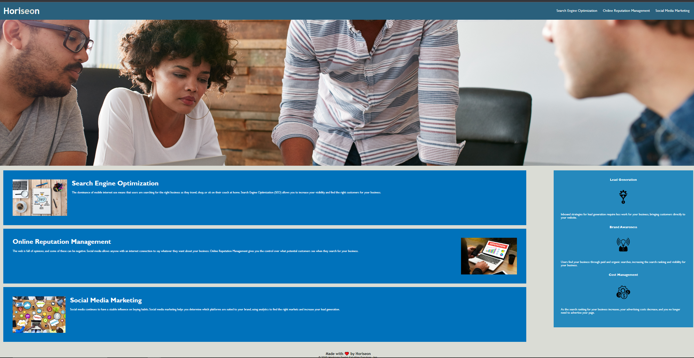

# Challenge Code Refactor

#### A Website For SEO & Marketing Strategies

## Technologies Used

* HTML
* CSS
* Will Power

## Description

This webpage is to showcase the Semantic HTML elements used in a basic website. Notes have been added to codes sections to make it more readable. CSS file is included for styling and code has been refactored with DRY principles in mind.

## Setup/Installation Requirements

* Deploy index.html to a webserver on the root directory
* Include Images and CSS folders in their original file structure
* Load in web browser

## Known Bugs

* No responsive elements or media queries
* Div boxes are not correctly aligned on all screen resolutions

## Screenshots

## License

MIT License

Copyright (c) Martin Graham